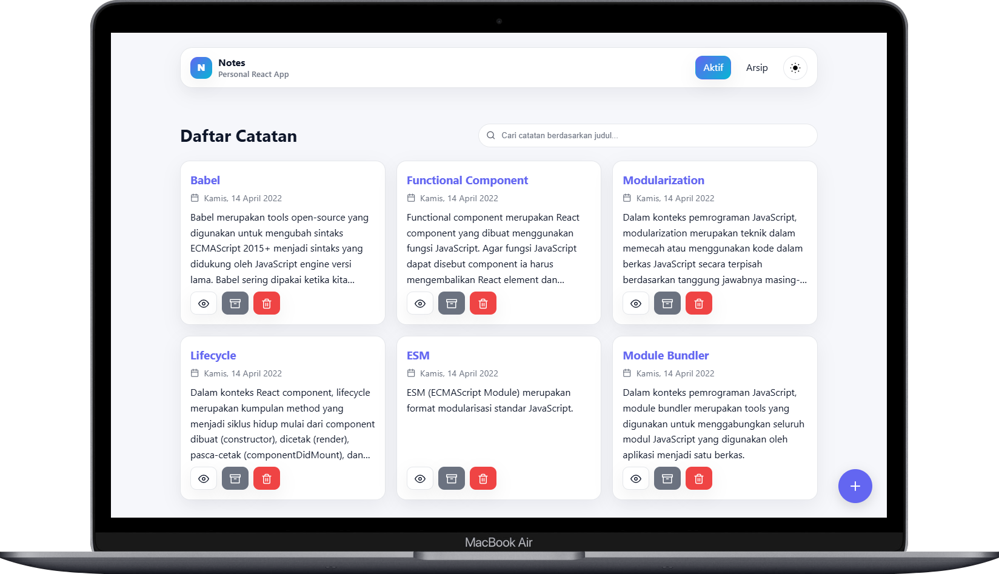
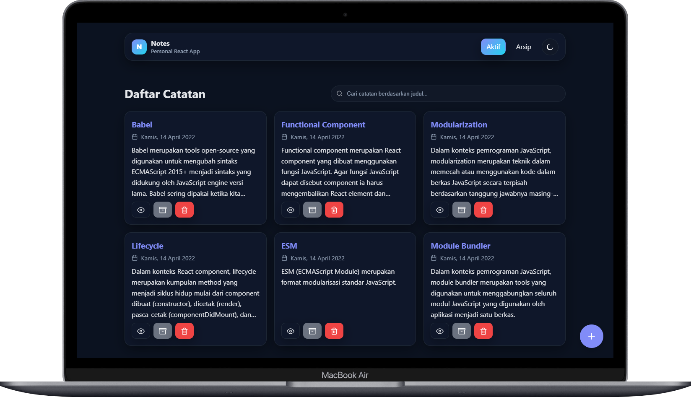

# Personal Notes SPA (React)

Aplikasi catatan pribadi berbasis **React** yang **cepat**, **aksesibel**, dan **responsif**. Fitur utama: **tambah catatan**, **pencarian**, **arsip/aktifkan**, **hapus**, dan **halaman detail**, seluruhnya berjalan sebagai **Single-Page Application** menggunakan **React Router**.

> Proyek ini ditujukan untuk memenuhi **Submission Proyek: Membangun Single Page Application dengan React** pada kelas **Belajar Fundamental Aplikasi Web dengan React (Dicoding)**. Semua kriteria wajib dan opsional telah dipenuhi.

<p align="center">
  
  
</p>

---

## ✨ Fitur

- **Daftar Catatan Aktif & Arsip**

  - List grid responsif, kartu catatan dengan **tanggal terbaca**.

- **Pencarian judul** (client-side, real-time).
- **Tambah Catatan Baru**

  - **Counter judul** (maks **50** karakter) dengan `aria-live="polite"`.
  - Editor konten sederhana (plain text).

- **Detail Catatan**

  - Aksi **Arsipkan/Aktifkan** & **Hapus** bisa dari laman detail maupun kartu.

- **Arsip / Aktifkan**

  - Memindahkan catatan antar tab **Aktif** ↔ **Arsip**.

- **Hapus Catatan**.
- **404 / Not Found** page yang rapi.
- **Tema Gelap/Terang** (opsional) + **persist** via `localStorage`.
- **Aksesibilitas**: fokus jelas, label tombol bermakna, live region untuk counter.

> **Sumber data**: file util `local-data.js` (sesuai ketentuan submission **tanpa modifikasi**).

---

## 🧱 Teknologi

- **React 18** (function components).
- **React Router v6** untuk SPA (routes: `/`, `/archives`, `/notes/new`, `/notes/:id`, `*`).
- **PropTypes** untuk **Property Validation** komponen utama.
- **CSS murni** dengan CSS variables (tanpa UI library).
- **State lokal** + lifting state ke halaman; data dimuat dari `local-data.js`.
- **Modular components** (single responsibility) agar mudah dirawat/diuji.

---

## ✅ Checklist Kriteria

- **Minimal 2 halaman**:

  - `Home (/)` – daftar catatan aktif + pencarian.
  - `Detail (/notes/:id)` – konten penuh + aksi.

- **Menambahkan catatan baru** – halaman `/notes/new`.
- **Menghapus catatan** – dari kartu maupun detail.
- **Arsip/Unarsip** – dari kartu dan detail (opsional → dipenuhi).
- **React Router** – navigasi tanpa reload (SPA).
- **Property Validation (PropTypes)** – diterapkan pada komponen data.
- **UX**:

  - Pencarian real-time.
  - Counter judul maksimal 50 dengan **`aria-live="polite"`**.
  - Halaman **404**.

> Seluruh **kriteria utama** & **opsional di submission** telah terpenuhi.

---

## 📁 Struktur Proyek

```
personal-notes-app-spa/
├─ docs/
│  ├─ screenshot-dark.png
│  └─ screenshot-light.png
├─ public/
│  └─ favicon.svg
├─ src/
│  ├─ components/
│  │  ├─ form/
│  │  │  ├─ Editor.jsx
│  │  │  ├─ FormActions.jsx
│  │  │  ├─ TitleCounter.jsx
│  │  │  └─ TitleInput.jsx
│  │  ├─ status/
│  │  │  ├─ NotFound.jsx
│  │  │  └─ StatusPage.jsx
│  │  ├─ EmptyState.jsx
│  │  ├─ FloatingAddButton.jsx
│  │  ├─ NoteCard.jsx
│  │  ├─ NoteList.jsx
│  │  ├─ SearchBar.jsx
│  │  └─ ThemeToggle.jsx
│  ├─ hooks/
│  │  └─ usePrefersDark.js
│  ├─ pages/
│  │  ├─ Add.jsx
│  │  ├─ Archive.jsx
│  │  ├─ Detail.jsx
│  │  ├─ Home.jsx
│  │  └─ NotFound.jsx
│  ├─ utils/
│  │  ├─ index.js
│  │  └─ local-data.js            # (gunakan file asli dari Dicoding, jangan diubah)
│  ├─ App.jsx
│  ├─ index.css
│  └─ main.jsx
├─ .gitignore
├─ index.html
├─ LICENSE
├─ package-lock.json
├─ package.json
├─ README.md
└─ vite.config.js
```

---

## 🧩 Model Data

```ts
type Note = {
  id: string; // unik (mis. Date.now().toString())
  title: string; // maks 50 karakter
  body: string;
  archived: boolean;
  createdAt: string; // ISO date string
};
```

> Data awal & helper tersedia pada `src/utils/local-data.js` dan `src/utils/date.js`.

---

## 🚀 Menjalankan Proyek

### Prasyarat

- **Node.js ≥ 18** (LTS)
- **npm ≥ 9** / **pnpm** / **yarn**

### Instalasi & Development

```bash
npm install
npm run dev
```

Buka URL yang dicetak Vite (biasanya `http://localhost:5173`).

### Build & Preview Production

```bash
npm run build
```

---

## ♿ Aksesibilitas

- **Label tombol** selalu teks (ikon dekoratif saja).
- **Focus ring** jelas (`:focus-visible`).
- **Live region** untuk sisa karakter judul.
- **Kontras** tema diuji agar nyaman di light/dark.

---

## 🧪 Uji Manual

- [x] Tambah catatan dengan judul > 50 → dicegah & counter berhenti di **0**.
- [x] Pencarian menyaring **judul** di daftar aktif maupun arsip.
- [x] **Arsipkan** dari kartu & detail → berpindah ke **Arsip**.
- [x] **Aktifkan** dari kartu & detail → kembali ke **Aktif**.
- [x] **Hapus** dari kartu & detail → item hilang & navigasi wajar.
- [x] **Router**: URL berubah tanpa reload, **NotFound** tampil untuk rute tak dikenal.
- [x] **Theme toggle** berfungsi & persist (opsional).

---

## 🌐 Deployment

**Netlify / Vercel** (preset **Vite**):

- Build Command: `npm run build`
- Publish Directory: `dist`
- SPA Fallback: aktifkan redirect `/* → /index.html`.

---

## 👤 Penulis

- GitHub: **[https://github.com/irfandwisamudra](https://github.com/irfandwisamudra)**
